The paper summary of Online Learning and Optimization by Enming Liang

- [Online Convex Programming and Generalized Infinitesimal Gradient Ascent](#online-convex-programming-and-generalized-infinitesimal-gradient-ascent)
  - [Main idea](#main-idea)
  - [Definitions](#definitions)
  - [Algorithm guarantee](#algorithm-guarantee)
  - [Connection with Repeated Game](#connection-with-repeated-game)
  - [Connection with Online Linear Programming](#connection-with-online-linear-programming)
  - [Conclusion remarks](#conclusion-remarks)
- [Dual Averaging Method for Regularized Stochastic Learning and Online Optimization](#dual-averaging-method-for-regularized-stochastic-learning-and-online-optimization)
  - [Main idea](#main-idea-1)
  - [Definitions](#definitions-1)
  - [Alogrithm](#alogrithm)
  - [Performance guarantee](#performance-guarantee)
  - [Connection with FOBOS](#connection-with-fobos)
  - [Conclusion remarks](#conclusion-remarks-1)
- [Parallelizing Exploration-Exploitation Tradeoffs in Gaussian Process Bandit Optimization](#parallelizing-exploration-exploitation-tradeoffs-in-gaussian-process-bandit-optimization)
  - [Main idea](#main-idea-2)
  - [Definitions](#definitions-2)
  - [Technical details](#technical-details)
  - [Algorithm](#algorithm)
  - [Experiments](#experiments)
  - [Conclusion remarks](#conclusion-remarks-2)

### Online Convex Programming and Generalized Infinitesimal Gradient Ascent
#### Main idea
1. an algorithm for general convex functions based on gradient descent
   1. simple, 
   2. general, handle an arbitrary sequence of convex functions
   3. in some circumstances perform better than an experts algorithm
2. background:
   1. infinitesimal gradient ascent
   2. repeated games
 
#### Definitions
1. Online convex programming
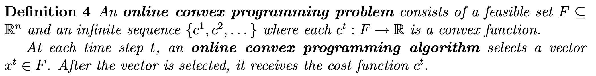
2. Greedy Projection
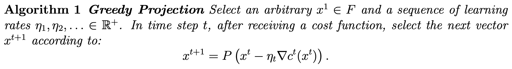
3. Lazy Projection
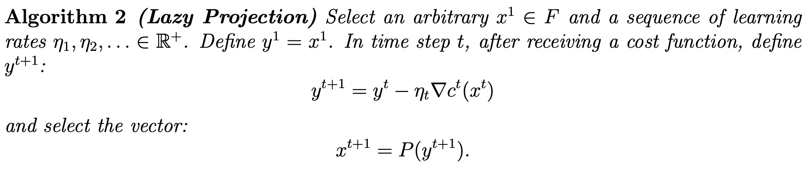
4. Performance
   1. online performance

   2. offline static benchmark

   1. regret 

   1. dynamic regret (dynamic offline strategy with path constraints)
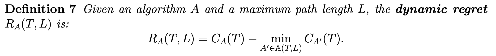

#### Algorithm guarantee
1. regret bound
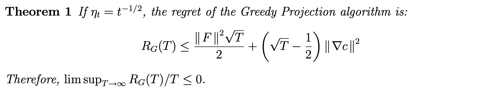
2. dynamic regret bound
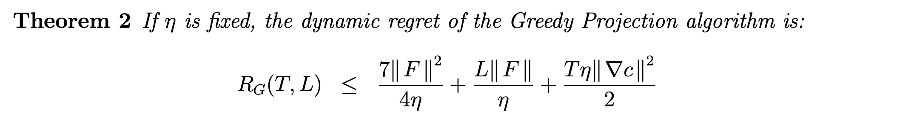
3. regret bound for lazy projection
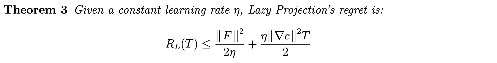

#### Connection with Repeated Game
1. Repeated Game
    1. action: player A and environment Y
    2. history: sequence of joint actions

    3. utility: 

    4. regret of not playing action a

    5. behavior: mapping from history to action probability
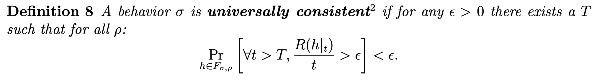
    6. oblivious deterministic environment: 
       1. plays the same sequence of actions regardless of the actions of the player
2. Repeated Game as an Online Linear Program
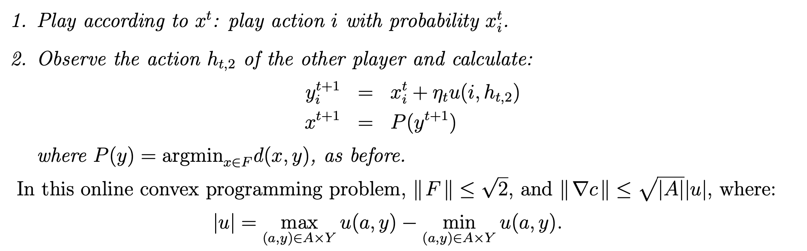
   1. greedy projection:
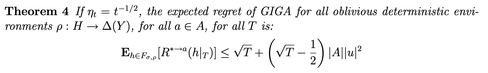
   1. Lazy Projection and Fictitious Play
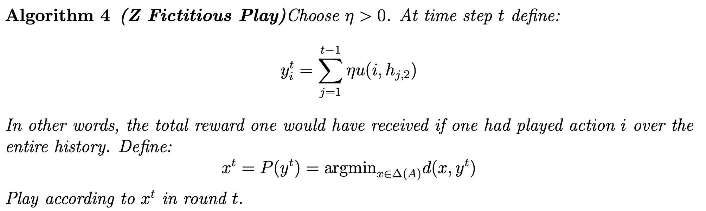

#### Connection with Online Linear Programming
1. Expert problem
   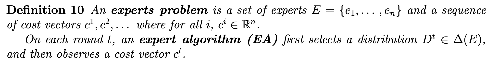
2. EA as online linear programming
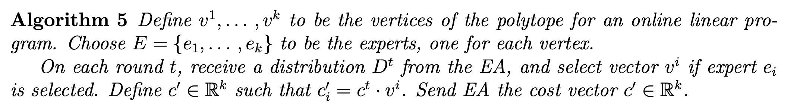
3. online linear as online convex

#### Conclusion remarks
1. Presenting a gradient based algorithm for online convex programming 
   1. derive regret bound for different projection-based algorithm
2. Building its connection with Repeated Game and Fictitious Play
   1. prove universal consistency
3. Converting expert algorithm -> online linear programming -> online convex programming

### Dual Averaging Method for Regularized Stochastic Learning and Online Optimization
#### Main idea
1. online algorithm for SGD with regularizer
2. running average of all past subgradients (RDA)
   1. uses an auxiliary strongly convex function
   2. $O(\sqrt{t})$ regret, $O(\ln(t))$ for strongly convex regularizer
   3. explicit regularization effect at each iteration 

#### Definitions
1. Regularized stochastic learning
   
   1. $f(w,z)$ is convex function for each $z$ (Least-squares, hinge)
   2. $\Psi(w)$ is convex function (L-2, L-1)
2. Regret for online learning 
   
#### Alogrithm
1. Input strongly convex function $h(w)$ with minimizer as $\Psi$
   
2. Running average of sub-gradient:
   
3. next $w$ (close form for simple function)
  
#### Performance guarantee
1. analysis framework
   1. FTRL: 
   2. RDA: 
   3. similar idea, different parameters

#### Connection with FOBOS 
1. l1-regularization
   1. auxiliary convex function: 

   2. RDA: 
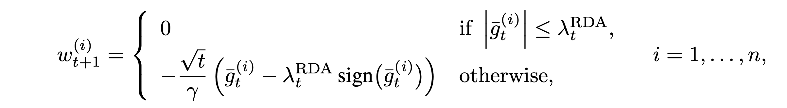
      1. truncating threshold: 

1. FOBOS
   
   2. truncating threshold:

3. the RDA method can generate much more sparse solutions.

#### Conclusion remarks
1. Using online algorithm to analyse SGD with regularizer (FTRL)
   1. design auxiliary function when $\Psi$ is not convex
2. practical in l1-regularization task

### Parallelizing Exploration-Exploitation Tradeoffs in Gaussian Process Bandit Optimization

#### Main idea
1. Bayesian optimization with batch exploration-exploitation
2. Different form single trail and update
   1. computational: combinatorially large set of possible batches
   2. statistical: performance depends on the size of the batches

#### Definitions
1. Bandit and regret:
   1. noisy scalar reward
   2. minimizing the cumulative regret
2. Parallel setting
   1. design batch actions evaluated in parallel
3. Delayed Selection
   1. feedback selection: start a new experiment as soon as one finishes
   
#### Technical details
1. Gaussian Processes 
   1. modeling reward function
   2. updating posterior distribution 
   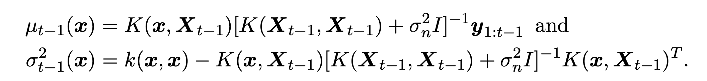
2. Mutual information
   1. Mutual information for new observation
      1. Used to evaluate the information gain conditioned on existing distribution
      2. monotonicity
      3. submodularity

   2. Conditional mutual information of new observation given last observation

   3. Maximum mutual information based approach

#### Algorithm
1. GP-UCB for Strictly Sequential Selection

   1. sublinear regret
   2. Batch selection
      1. Naive approach: update posterior with new feedback
      2. Encourage exploration: GP-BUCB 
2. GP-BUCB 
   1. update mean need experiment results
   2. update variance does not nedd
   3. decision rule: use all information so far
   
      1. encourage exploration with newest variance information
      2. disadvantage: exploratory redundancy since confidence interval is proportional to variance
   1. To avoid overconfidence
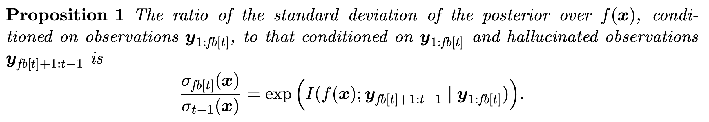
      1. bounded variance ratio -> then choose interval width to adjust it
 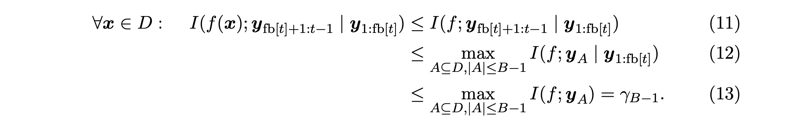
   2. Initialization of variance

1. Adaptive Parallelism: GP-AUCB
   1. Adaptively to conduct new experiments
      1. instead of conducting new experiments once receiving feedback, choose whether to conduct new experiments depend on the feedback.
      2. checks if this quantity is more than a pre-defined variance ratio
   2. Locally Stopped Adaptive Algorithms
      1. stop exploration when reach the threshold of variance ratio
   3. Lazy Variance Calculations
      1. maintain an upper bound of variance 
#### Experiments
1. Different datasets

#### Conclusion remarks
1. Unified framework to analyze the batch exploration-exploitation problem
2. Core idea is to bound the ratio of updated variance
   1. initialization of variance
   2. early-stop based on variance
   3. lazy updating of variance