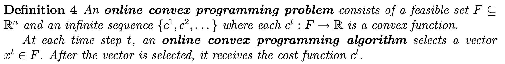
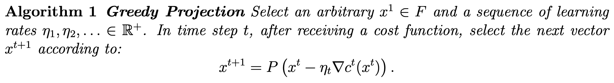
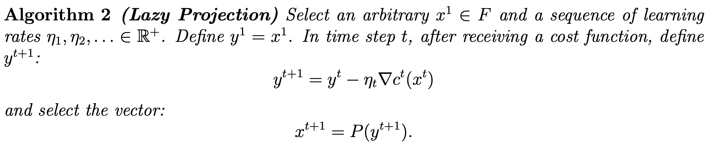
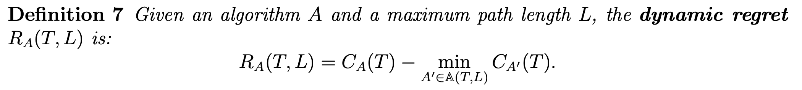
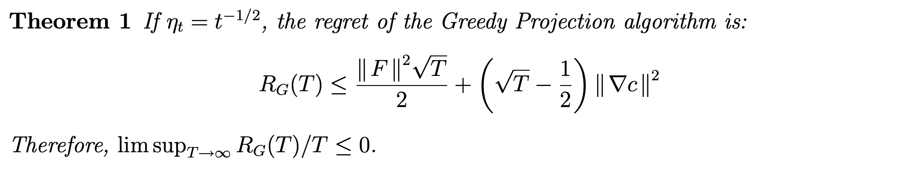
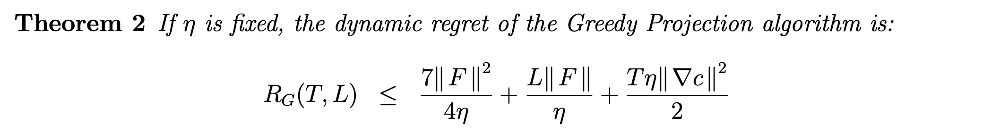
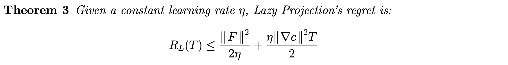

# 2022_SDSC8014_Paper_Summary
The paper summary of Online Learning and Optimization by Enming Liang

### Online Convex Programming and Generalized Infinitesimal Gradient Ascent
#### Main idea
1. an algorithm for general convex functions based on gradient descent
   1. simple, 
   2. general, handle an arbitrary sequence of convex functions
   3. in some circumstances perform better than an experts algorithm
2. background:
   1. infinitesimal gradient ascent
   2. repeated games
 
#### Definitions
1. Online convex programming

2. Greedy Projection

3. Lazy Projection

4. Performance
   1. online performance

   2. offline static benchmark

   1. regret 

   1. dynamic regret (dynamic offline strategy with path constraints)

#### Algorithm guarantee
1. regret bound

2. dynamic regret bound

3. regret bound for lazy projection

#### Application
1. Repeated Game
    1. action: player A and environment Y
    2. history: sequence of joint actions

    3. utility: 

    4. regret of not playing action a

    5. behavior: mapping from history to action probability
#### 

